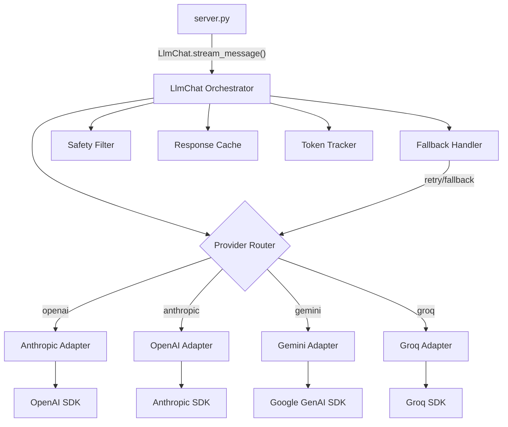

# Design Document: AI Engine Enhancement

## Overview

This design replaces the non-functional shim at `backend/emergentintegrations/llm/chat.py` with a production-ready multi-provider AI engine. The module maintains the existing public interface (`LlmChat`, `UserMessage`, `TextDelta`, `StreamDone`) while internally implementing provider adapters, streaming, retry/fallback logic, safety filtering, and response caching.

The architecture follows an **adapter pattern** where each LLM provider (OpenAI, Anthropic, Gemini, Groq) gets a dedicated adapter class behind a unified `ProviderAdapter` protocol. The `LlmChat` class orchestrates provider selection, message formatting, retry/fallback handling, safety checks, and caching — all invisible to the calling code in `server.py`.

**Key Design Decisions:**
- **Drop-in replacement**: Zero changes to `server.py` imports or calling conventions
- **Adapter pattern**: Each provider has its own adapter handling SDK-specific formatting and streaming
- **Composition over inheritance**: `LlmChat` composes adapters, fallback handler, safety filter, and cache
- **Lazy initialization**: Provider clients are created on first use, not at import time (so the server starts even with missing keys)
- **Async-native**: All I/O operations use async/await, matching the existing FastAPI architecture

## Architecture



**Module Internal Structure:**

```
backend/emergentintegrations/llm/
├── chat.py              # Public module — exports LlmChat, UserMessage, TextDelta, StreamDone
├── _adapters.py         # Provider adapter protocol + implementations
├── _fallback.py         # Retry logic + fallback chain
├── _safety.py           # Content safety filter
├── _cache.py            # LRU response cache with TTL
├── _models.py           # Internal data models (AdapterConfig, UsageInfo, etc.)
└── __init__.py          # Re-exports from chat.py
```

The `chat.py` file remains the single entry point. Internal modules are prefixed with `_` to signal they are private implementation details.

## Components and Interfaces

### 1. Public Interface (chat.py)

```python
@dataclass
class UserMessage:
    text: str

@dataclass
class TextDelta:
    content: str

@dataclass
class StreamDone:
    pass

class LlmChat:
    def __init__(
        self,
        api_key: str = "",
        session_id: str = "",
        system_message: str = "",
        history: list[dict] | None = None,
        temperature: float | None = None,
        top_p: float | None = None,
        max_tokens: int | None = None,
        cache_enabled: bool = True,
        buddy_type: str | None = None,
    ): ...

    def with_model(self, provider: str, model: str) -> "LlmChat": ...
    async def stream_message(self, message: UserMessage) -> AsyncIterator[TextDelta | StreamDone]: ...
    def get_last_usage(self) -> dict | None: ...
```

**Backward compatibility:** The constructor signature adds new optional parameters (history, temperature, top_p, max_tokens, cache_enabled, buddy_type) but preserves the original `api_key`, `session_id`, `system_message` positional parameters. Existing calls in `server.py` continue to work unchanged.

### 2. Provider Adapter Protocol (_adapters.py)

```python
from typing import Protocol, AsyncIterator, Any

class ProviderAdapter(Protocol):
    """Protocol all provider adapters must satisfy."""
    
    async def stream_completion(
        self,
        messages: list[dict[str, Any]],
        temperature: float,
        top_p: float | None,
        max_tokens: int,
    ) -> AsyncIterator[tuple[str, dict | None]]:
        """
        Yield (text_chunk, usage_info_or_None) tuples.
        The last yield may include usage info from the provider's response.
        """
        ...

    def format_messages(
        self,
        system_message: str,
        history: list[dict[str, str]],
        current_message: str,
    ) -> list[dict[str, Any]]:
        """Format messages according to provider-specific schema."""
        ...
```

**Adapter Implementations:**

| Adapter | SDK | Base URL | Message Format |
|---------|-----|----------|----------------|
| `OpenAIAdapter` | `openai` | api.openai.com | `[{role, content}]` with system as first message |
| `AnthropicAdapter` | `anthropic` | api.anthropic.com | `system` param + `messages: [{role, content}]` |
| `GeminiAdapter` | `google-generativeai` | generativelanguage.googleapis.com | `contents: [{role, parts: [{text}]}]` |
| `GroqAdapter` | `groq` | api.groq.com | OpenAI-compatible `[{role, content}]` |

### 3. Fallback Handler (_fallback.py)

```python
class FallbackHandler:
    TRANSIENT_CODES = {429, 500, 502, 503}
    NON_TRANSIENT_CODES = {400, 401, 403}
    MAX_RETRIES = 2
    INITIAL_BACKOFF = 1.0  # seconds
    RATE_LIMIT_BACKOFF = 2.0  # seconds (when no Retry-After header)

    FALLBACK_CHAIN = {
        "openai": ("groq", "llama-3.3-70b-versatile"),
        "anthropic": ("openai", "gpt-4o-mini"),
        "gemini": ("groq", "llama-3.3-70b-versatile"),
        "groq": ("openai", "gpt-4o-mini"),
    }

    async def execute_with_retry(
        self,
        adapter: ProviderAdapter,
        messages: list,
        params: dict,
        fallback_adapter_factory: Callable,
    ) -> AsyncIterator[tuple[str, dict | None]]: ...
```

**Retry logic:**
1. On transient error → retry up to 2 times with exponential backoff (1s, 2s)
2. On HTTP 429 with `Retry-After` header → wait that duration, then retry
3. On HTTP 429 without `Retry-After` → exponential backoff starting at 2s
4. If all retries fail → try fallback provider
5. If fallback also fails → yield graceful error message
6. On non-transient error (400/401/403) → immediately yield error, no retry

### 4. Safety Filter (_safety.py)

```python
class SafetyFilter:
    """Screens AI output for blocked content patterns."""
    
    DIAGNOSIS_PATTERNS: list[re.Pattern]  # Medical diagnosis regexes
    SELF_HARM_PATTERNS: list[re.Pattern]  # Self-harm/dangerous content regexes
    
    def check(self, text: str) -> tuple[bool, str | None, str | None]:
        """
        Returns (is_safe, replacement_text_or_None, filter_reason_or_None).
        If is_safe is False, replacement_text contains the safe alternative.
        """
        ...
```

**Pattern categories:**
- **Medical diagnosis**: Patterns like "you have [condition]", "you are diagnosed with", "your symptoms indicate [disease]"
- **Self-harm**: Patterns matching encouragement of self-harm, suicide methods, dangerous activities
- **Safe alternatives**: Pre-defined replacement messages per category:
  - Diagnosis → "I'm not qualified to diagnose medical conditions. Please consult a healthcare professional for proper evaluation."
  - Self-harm → "If you're going through a difficult time, please reach out to a crisis helpline. In India: iCall (9152987821) or Vandrevala Foundation (1860-2662-345)."

### 5. Response Cache (_cache.py)

```python
from cachetools import TTLCache
import hashlib

class ResponseCache:
    """LRU + TTL cache for LLM responses."""
    
    def __init__(self, maxsize: int = 1000, ttl: int = 3600):
        self._cache = TTLCache(maxsize=maxsize, ttl=ttl)
    
    def _make_key(self, provider: str, model: str, system_hash: str, user_message: str) -> str:
        """Generate cache key from request parameters."""
        raw = f"{provider}:{model}:{system_hash}:{user_message}"
        return hashlib.sha256(raw.encode()).hexdigest()
    
    def get(self, provider: str, model: str, system_message: str, user_message: str) -> str | None: ...
    def put(self, provider: str, model: str, system_message: str, user_message: str, response: str) -> None: ...
```

**Cache behavior:**
- Key = hash of (provider, model, sha256(system_message), user_message)
- TTL = 1 hour (3600s)
- Max size = 1000 entries
- Eviction = LRU (built into `cachetools.TTLCache`)
- Cache hits still produce `TextDelta` + `StreamDone` for interface consistency

### 6. Message Formatting per Provider

**OpenAI / Groq (OpenAI-compatible):**
```python
[
    {"role": "system", "content": system_message},
    {"role": "user", "content": history_msg_1},      # from history
    {"role": "assistant", "content": history_msg_2},  # from history
    {"role": "user", "content": current_message},     # current
]
```

**Anthropic:**
```python
# system is a top-level parameter, not in messages array
system = system_message
messages = [
    {"role": "user", "content": history_msg_1},
    {"role": "assistant", "content": history_msg_2},
    {"role": "user", "content": current_message},
]
```

**Gemini:**
```python
# system_instruction is a separate parameter
contents = [
    {"role": "user", "parts": [{"text": history_msg_1}]},
    {"role": "model", "parts": [{"text": history_msg_2}]},
    {"role": "user", "parts": [{"text": current_message}]},
]
```

## Data Models

### Internal Configuration Models (_models.py)

```python
@dataclass
class AdapterConfig:
    provider: str
    model: str
    api_key: str
    temperature: float = 0.7
    top_p: float | None = None
    max_tokens: int = 1024

@dataclass
class UsageInfo:
    prompt_tokens: int
    completion_tokens: int
    total_tokens: int

@dataclass  
class StreamEvent:
    """Internal event type wrapping either content or completion signal."""
    content: str | None = None
    is_done: bool = False
    usage: UsageInfo | None = None

FALLBACK_MESSAGES: dict[str, str] = {
    "finance": (
        "I'm having trouble connecting right now. In the meantime, "
        "check your expense log in the Expenses tab or review your budget "
        "allocations to stay on track."
    ),
    "wellness": (
        "I'm temporarily unavailable, but you're doing great by checking in. "
        "Try a quick breathing exercise: inhale for 4 counts, hold for 4, "
        "exhale for 4. I'll be back shortly."
    ),
    "discover": (
        "I can't connect right now. While I'm away, check your campus "
        "student portal or notice boards for deals and events. "
        "I'll be back to help soon!"
    ),
    "helper": (
        "I'm experiencing a brief interruption. Please try again in a moment. "
        "In the meantime, your expense logs, mood entries, and tasks are all "
        "accessible from the main tabs."
    ),
}

# Environment variable mapping per provider
PROVIDER_ENV_KEYS: dict[str, str] = {
    "openai": "OPENAI_API_KEY",
    "anthropic": "ANTHROPIC_API_KEY",
    "gemini": "GEMINI_API_KEY",
    "groq": "GROQ_API_KEY",
}

SUPPORTED_PROVIDERS = frozenset(PROVIDER_ENV_KEYS.keys())
```

### Key Resolution Logic

```python
def _resolve_api_key(provider: str, constructor_key: str) -> str:
    """
    Priority: constructor api_key > provider-specific env var > EMERGENT_LLM_KEY (legacy).
    Raises ConfigurationError if no key is available at request time.
    """
```

## Correctness Properties

*A property is a characteristic or behavior that should hold true across all valid executions of a system — essentially, a formal statement about what the system should do. Properties serve as the bridge between human-readable specifications and machine-verifiable correctness guarantees.*

### Property 1: Provider Routing Correctness

*For any* supported provider name in {"openai", "anthropic", "gemini", "groq"} and *for any* non-empty model name string, calling `LlmChat().with_model(provider, model)` SHALL configure the corresponding adapter class for that provider.

**Validates: Requirements 1.2, 1.3, 1.4, 1.5**

### Property 2: Unsupported Provider Rejection

*For any* string that is NOT in the set {"openai", "anthropic", "gemini", "groq"}, calling `LlmChat().with_model(provider, model)` SHALL raise a `ValueError` whose message contains the unsupported provider name.

**Validates: Requirements 1.6**

### Property 3: Stream Termination Invariant

*For any* call to `stream_message` that completes (whether from a live provider, cache, or error fallback), the final yielded object SHALL always be a `StreamDone` instance, and all preceding yielded objects SHALL be `TextDelta` instances.

**Validates: Requirements 2.1, 2.2, 7.4**

### Property 4: Missing API Key Detection

*For any* supported provider, if the corresponding environment variable is unset or empty AND no `api_key` override is provided in the constructor, calling `stream_message` SHALL raise a configuration error whose message identifies the missing environment variable name.

**Validates: Requirements 3.5**

### Property 5: Transient Error Retry Behavior

*For any* transient HTTP error code in {429, 500, 502, 503} or network timeout, the fallback handler SHALL retry the request up to 2 additional times before attempting the fallback provider. The total number of attempts to the primary provider SHALL never exceed 3.

**Validates: Requirements 4.1, 10.1, 10.2**

### Property 6: Non-Transient Error Immediate Failure

*For any* non-transient HTTP error code in {400, 401, 403}, the AI_Engine SHALL yield an error TextDelta followed by StreamDone without making any retry attempts or fallback calls.

**Validates: Requirements 4.5**

### Property 7: Message Formatting Correctness

*For any* provider in {"openai", "anthropic", "gemini", "groq"}, *for any* system message string, *for any* conversation history list (0 to N messages with role/content), and *for any* current user message, the adapter's `format_messages` output SHALL: (a) include the system message in the provider-specific system position, (b) include all history messages in chronological order, (c) place the current user message last, and (d) conform to the provider's documented schema structure.

**Validates: Requirements 5.1, 5.3, 5.4, 12.1, 12.2, 12.3, 12.4, 12.5**

### Property 8: Safety Filter Correctness

*For any* response text, the safety filter SHALL either: (a) pass the text through unchanged if it matches no blocked patterns, or (b) replace it with a safe alternative if it matches a medical diagnosis or self-harm pattern. The filter SHALL never modify text that does not match any blocked pattern, and SHALL always replace text that does match.

**Validates: Requirements 6.1, 6.2, 6.3**

### Property 9: Cache Round-Trip with Interface Consistency

*For any* response string stored in the cache under a given (provider, model, system_message, user_message) key, a subsequent lookup with the same key SHALL return the original response, and when served from cache, the output SHALL consist of one or more TextDelta objects whose concatenated content equals the cached string, followed by a StreamDone.

**Validates: Requirements 7.1, 7.4**

### Property 10: Cache LRU Eviction at Capacity

*For any* sequence of N unique cache entries where N > 1000, the cache size SHALL never exceed 1000 entries, and the evicted entries SHALL be the least-recently-used ones.

**Validates: Requirements 7.3**

### Property 11: Domain-Appropriate Fallback Messages

*For any* buddy type in {"finance", "wellness", "discover", "helper"}, when all provider attempts (including retries and fallback) fail, the yielded TextDelta content SHALL contain domain-appropriate guidance specific to that buddy type (not a generic error).

**Validates: Requirements 11.1, 11.2, 11.3, 11.4, 11.5**

## Error Handling

### Error Categories and Responses

| Error Type | HTTP Code | Behavior | User Impact |
|------------|-----------|----------|-------------|
| Transient provider error | 429, 500, 502, 503 | Retry 2x with exponential backoff, then fallback provider | Slight delay, then response |
| Rate limited (with Retry-After) | 429 | Wait specified duration, retry | Slight delay |
| Non-transient error | 400, 401, 403 | Immediate graceful error message | User sees friendly error |
| Missing API key | — | ConfigurationError at request time | Error message identifying key |
| Unsupported provider | — | ValueError at `with_model()` call | Developer-facing error |
| All providers down | — | Domain-appropriate fallback message | Helpful guidance without AI |
| Safety filter triggered | — | Silent replacement with safe text | User sees safe alternative |
| Network timeout | — | Treated as transient, retried | Slight delay |

### Error Response Format

All error paths still yield `TextDelta` + `StreamDone` to maintain interface consistency:

```python
# On unrecoverable error:
yield TextDelta(content="I'm having trouble connecting right now...")
yield StreamDone()
```

### Logging Strategy

- **INFO**: Successful completions, cache hits
- **WARNING**: Retries, fallback activations, rate limits, safety filter triggers, missing data
- **ERROR**: Unrecoverable failures, unexpected exceptions

All log entries include: timestamp, provider name, model, session_id, and relevant error details.

## Testing Strategy

### Property-Based Tests (Hypothesis)

The project already uses `hypothesis>=6.100.0` (in requirements.txt) with `pytest-asyncio`. Each correctness property maps to a property-based test with minimum 100 iterations.

**Library**: `hypothesis` (Python)  
**Runner**: `pytest` with `pytest-asyncio`  
**Configuration**: `@settings(max_examples=100)`

Each property test is tagged with:
```python
# Feature: ai-engine-enhancement, Property {N}: {property_text}
```

**Property tests cover:**
1. Provider routing (generate random provider/model strings)
2. Unsupported provider rejection (generate strings excluding valid providers)
3. Stream termination invariant (mock various provider response sequences)
4. Missing API key detection (test all providers with cleared env vars)
5. Transient error retry behavior (generate random transient error sequences)
6. Non-transient error no-retry (generate random non-transient codes)
7. Message formatting (generate random system/history/message combinations per provider)
8. Safety filter (generate strings with/without blocked patterns)
9. Cache round-trip (generate random cache entries and lookups)
10. Cache LRU eviction (generate insertion sequences exceeding capacity)
11. Domain-appropriate fallback (all buddy types with total failure)

### Unit Tests (pytest)

- API key resolution priority (constructor > env var > legacy key)
- Default parameter values (temperature=0.7, max_tokens=1024)
- Token usage tracking (with and without provider usage data)
- Rate limit handling with Retry-After header parsing
- Cache TTL expiration
- Safety filter specific pattern matching
- Adapter-specific SDK call formatting

### Integration Tests

- Full streaming flow with mocked provider SDKs
- Context engine integration (assembled context appears in system prompt)
- Conversation memory round-trip (store → retrieve → include in prompt)
- SSE event formatting (TextDelta → SSE `data:` lines)
- Server startup with missing API keys (should not crash)
- Each AI-powered endpoint with mocked LlmChat

### Test Organization

```
backend/tests/
├── test_ai_engine_properties.py    # Property-based tests (11 properties)
├── test_ai_adapters.py             # Unit tests for each adapter
├── test_ai_fallback.py             # Retry/fallback unit tests
├── test_ai_safety.py               # Safety filter unit tests
├── test_ai_cache.py                # Cache behavior unit tests
└── test_ai_integration.py          # Integration tests with mocked providers
```
