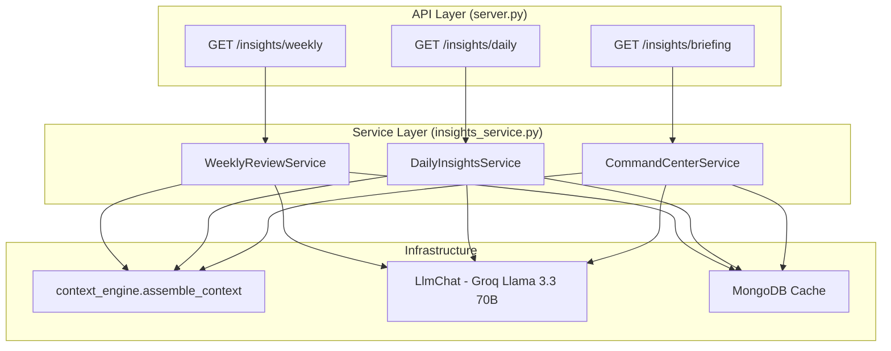

# Design Document: AI Insights Enhancement

## Overview

This design transforms PocketBuddy's insights system from hardcoded/template-driven outputs into AI-powered, data-grounded features. Three new backend services — `WeeklyReviewService`, `DailyInsightsService`, and `CommandCenterService` — will be created in `backend/insights_service.py`. Each service follows the established pattern: takes `db` as a constructor argument, uses `context_engine.assemble_context()` for data gathering, and uses `LlmChat` with Groq Llama 3.3 70B for natural language generation.

The architecture prioritizes reliability through timeout-enforced LLM calls, rule-based fallbacks, MongoDB caching, and data grounding validation. All generated text must reference actual numeric values from the user's assembled context.

## Architecture



### Key Design Decisions

1. **Single service file**: All three services live in `backend/insights_service.py` to keep the insights domain cohesive and reduce import complexity.
2. **Non-streaming LLM usage**: Since insights endpoints return structured JSON (not chat), we collect the full LLM response before returning, following the same pattern as `discover_travel_service.py`.
3. **asyncio.wait_for for timeouts**: Each LLM call is wrapped in `asyncio.wait_for()` with service-specific timeouts (3–5 seconds for LLM portion).
4. **Previous week via storage**: Weekly scores are stored in `weekly_scores` collection on computation. Trends are computed by looking up the previous ISO week's stored scores rather than re-running `assemble_context` with shifted dates.
5. **Cache invalidation via data hooks**: When new data is written (expense, mood, task), the weekly cache for that user is invalidated by the existing endpoint handlers in `server.py`.

## Components and Interfaces

### WeeklyReviewService

```python
class WeeklyReviewService:
    def __init__(self, db):
        self.db = db

    async def get_weekly_review(self, user_id: str) -> dict:
        """
        Main entry point. Returns:
        {
            "scorecard": [...],
            "highlights": [...],
            "next_week_focus": str,
            "data_sufficiency": "full" | "partial" | "insufficient",
            "generated_at": str
        }
        """

    async def _get_cached_review(self, user_id: str, iso_week: str) -> Optional[dict]:
        """Check weekly_insights cache by user_id + ISO week."""

    async def _compute_scores(self, context: dict) -> list[dict]:
        """Map assembled context scores to domain scorecard entries."""

    async def _compute_trends(self, user_id: str, current_scores: dict) -> dict:
        """Look up previous week's stored scores, compute differences."""

    async def _store_weekly_scores(self, user_id: str, iso_week: str, scores: dict):
        """Persist current week's scores for future trend computation."""

    async def _generate_highlights(self, context: dict) -> list[str]:
        """Call LLM for 3 highlight strings, with timeout + fallback."""

    async def _generate_focus(self, scores: list, trends: dict, context: dict) -> str:
        """Call LLM for 1 focus recommendation, with timeout + fallback."""

    def _fallback_highlights(self, context: dict) -> list[str]:
        """Rule-based highlights from raw_data when LLM fails."""

    def _fallback_focus(self, scores: list, trends: dict) -> str:
        """Template-based focus from lowest domain score."""

    async def _cache_review(self, user_id: str, iso_week: str, review: dict):
        """Store completed review in weekly_insights collection."""

    async def invalidate_cache(self, user_id: str):
        """Delete cached weekly review for current ISO week."""
```

### DailyInsightsService

```python
class DailyInsightsService:
    def __init__(self, db):
        self.db = db

    async def get_daily_insights(self, user_id: str) -> dict:
        """
        Returns:
        {
            "insights": [InsightCard, InsightCard, InsightCard],
            "data_sufficiency": "full" | "partial" | "onboarding",
            "generated_at": str,
            "date": str
        }
        """

    async def _generate_llm_insights(self, context: dict) -> list[dict]:
        """Call LLM for conversational insight text per domain, with 3s timeout."""

    def _fallback_insights(self, context: dict) -> list[dict]:
        """Existing rule-based logic (current _generate_daily_insights)."""

    def _onboarding_insights(self) -> list[dict]:
        """Generic cards prompting user to log data."""
```

### CommandCenterService

```python
class CommandCenterService:
    def __init__(self, db):
        self.db = db

    async def get_briefing(self, user_id: str) -> dict:
        """
        Returns:
        {
            "summary": str,
            "actions": [{"domain": str, "suggestion": str}, ...],  # up to 3
            "nudge": str | None,
            "data_sufficiency": "full" | "partial" | "insufficient",
            "generated_at": str
        }
        """

    async def _generate_llm_briefing(self, context: dict) -> dict:
        """Call LLM for structured briefing, with 5s timeout."""

    def _fallback_briefing(self, context: dict) -> dict:
        """Construct briefing from lowest score + active stressors."""

    def _validate_nudge(self, nudge: str, context: dict) -> bool:
        """Ensure nudge references two domains and contains a numeric value."""
```

### Shared Utilities (within insights_service.py)

```python
async def _call_llm_with_timeout(
    system_prompt: str,
    user_prompt: str,
    timeout_seconds: float,
    temperature: float = 0.7,
    max_tokens: int = 512,
) -> Optional[str]:
    """
    Wrapper around LlmChat that enforces a timeout.
    Returns the full response text or None on failure/timeout.
    """

def _validate_grounding(text: str, context: dict) -> bool:
    """
    Check that generated text contains at least one numeric value
    that exists in the provided context data.
    """

def _get_iso_week(dt: datetime = None) -> str:
    """Return ISO week string like '2025-W03' for cache keying."""
```

## Data Models

### MongoDB Collections

#### `weekly_insights` (cache)
```json
{
    "user_id": "string",
    "iso_week": "2025-W03",
    "scorecard": [
        {"domain": "Finance", "score": 78, "trend": 4},
        {"domain": "Wellness", "score": 71, "trend": -3},
        {"domain": "Productivity", "score": 66, "trend": 8}
    ],
    "highlights": ["string", "string", "string"],
    "next_week_focus": "string",
    "data_sufficiency": "full",
    "generated_at": "2025-01-20T10:00:00Z",
    "created_at": "2025-01-20T10:00:00Z"
}
```

#### `weekly_scores` (historical scores for trend computation)
```json
{
    "user_id": "string",
    "iso_week": "2025-W03",
    "finance_score": 78,
    "wellness_score": 71,
    "productivity_score": 66,
    "computed_at": "2025-01-20T10:00:00Z"
}
```

#### `daily_insights` (existing, extended)
```json
{
    "user_id": "string",
    "date": "2025-01-20",
    "insights": [
        {
            "domain": "finance",
            "title": "string",
            "detail": "string",
            "icon": "string",
            "data_reference": "string"
        }
    ],
    "data_sufficiency": "full",
    "generated_at": "2025-01-20T10:00:00Z"
}
```

#### `daily_briefings` (cache for command center)
```json
{
    "user_id": "string",
    "date": "2025-01-20",
    "summary": "string",
    "actions": [
        {"domain": "finance", "suggestion": "string"},
        {"domain": "wellness", "suggestion": "string"}
    ],
    "nudge": "string or null",
    "data_sufficiency": "full",
    "generated_at": "2025-01-20T10:00:00Z"
}
```

### API Response Schemas

#### GET /insights/weekly
```json
{
    "scorecard": [
        {"domain": "Finance", "score": 78, "trend": 4},
        {"domain": "Wellness", "score": 71, "trend": -3},
        {"domain": "Productivity", "score": 66, "trend": 8}
    ],
    "highlights": [
        "Saved ₹420 by cooking 3 meals at home",
        "Slept 7+ hours on 4 nights",
        "Completed 18 of 25 tasks this week"
    ],
    "next_week_focus": "Protect bedtime: you averaged 6.2h this week — aim for 7h by setting a 11pm alarm.",
    "data_sufficiency": "full",
    "generated_at": "2025-01-20T10:00:00Z"
}
```

#### GET /insights/daily (enhanced response)
```json
{
    "insights": [
        {
            "domain": "finance",
            "title": "Food spending up 30% this week",
            "detail": "You spent ₹2,100 on food — that's 42% of your ₹5,000 weekly total. Try meal-prepping Sunday to cut this by ₹500.",
            "icon": "trending-up",
            "data_reference": "₹2100 food / ₹5000 total"
        }
    ],
    "data_sufficiency": "full",
    "generated_at": "2025-01-20T10:00:00Z",
    "date": "2025-01-20"
}
```

#### GET /insights/briefing (new endpoint)
```json
{
    "summary": "Your finances are solid at 78/100 but sleep dipped to 6.2h avg — today's a good day to recharge.",
    "actions": [
        {"domain": "wellness", "suggestion": "Set a bedtime alarm for 11pm tonight"},
        {"domain": "finance", "suggestion": "Review your food spending — ₹2,100 this week is above budget"},
        {"domain": "productivity", "suggestion": "Complete your top-priority task before lunch"}
    ],
    "nudge": "Your stress peaked on days you overspent — try a 5min walk instead of ordering in.",
    "data_sufficiency": "full",
    "generated_at": "2025-01-20T10:00:00Z"
}
```


## Correctness Properties

*A property is a characteristic or behavior that should hold true across all valid executions of a system — essentially, a formal statement about what the system should do. Properties serve as the bridge between human-readable specifications and machine-verifiable correctness guarantees.*

### Property 1: Score Mapping Produces Valid Domain Scores

*For any* assembled context with `financial_health_score`, `wellness_composite_score`, and `habit_consistency_percentage` values (each 0–100), and any combination of `unavailable_domains`, the score mapping SHALL produce a scorecard where: each available domain maps to the correct source score as an integer in [0, 100], and each unavailable domain maps to `null`.

**Validates: Requirements 1.2, 1.3, 1.4**

### Property 2: Trend Computation Correctness

*For any* pair of current week scores and previous week scores (each 0–100 integers), the computed trend SHALL equal `current_score - previous_score` as a signed integer. *For any* case where previous week data is unavailable (data_days < 3), the trend SHALL be `null` for all affected domains.

**Validates: Requirements 2.2, 2.3, 2.4**

### Property 3: Grounding Validation Identifies Numeric References

*For any* generated text string and assembled context dictionary, the grounding validation function SHALL return `true` if and only if the text contains at least one numeric value (integer or decimal) that appears in the context's raw_data, scores, or stressor descriptions.

**Validates: Requirements 3.2, 9.4**

### Property 4: Fallback Highlights Invariant

*For any* assembled context with at least one domain of raw_data present, the fallback highlights generator SHALL produce exactly 3 strings, each no longer than 80 characters, and each containing at least one numeric reference from the context.

**Validates: Requirements 3.3**

### Property 5: Focus Domain Selection

*For any* set of domain scores and trends where at least one domain has a valid score, the focus selection function SHALL identify the domain with the lowest score (or most negative trend in case of tie), and the fallback focus generator SHALL produce exactly 1 string no longer than 120 characters referencing that domain.

**Validates: Requirements 4.1, 4.3**

### Property 6: Daily Insights Structure

*For any* assembled context (including contexts with missing domains), the daily insights fallback generator SHALL produce exactly 3 Insight_Cards where: each card covers a distinct domain from {finance, wellness, productivity}, and each card contains a non-empty `data_reference` field.

**Validates: Requirements 5.3, 5.4**

### Property 7: Briefing Structure Invariant

*For any* assembled context with at least one valid domain score, the briefing response SHALL contain: a `summary` string, an `actions` array of at most 3 items where each has `domain` and `suggestion` fields, and the actions SHALL span at least 2 distinct domains when 2+ domains have data.

**Validates: Requirements 7.3, 7.4**

### Property 8: Nudge Constraints

*For any* assembled context where `sufficient_data` is true and correlations exist, the nudge SHALL be a string of at most 150 characters that names at least 2 distinct domains. *For any* context where `sufficient_data` is false, the nudge SHALL be `null` (omitted).

**Validates: Requirements 8.2, 8.3, 8.4, 10.3**

### Property 9: Data Sufficiency Field Invariant

*For any* response from any of the three services (Weekly, Daily, Briefing), the response SHALL contain a `data_sufficiency` field with a value from the set {"full", "partial", "insufficient", "onboarding"}. When `data_days < 3` for weekly insights, the value SHALL NOT be "full".

**Validates: Requirements 10.1, 10.4**

## Error Handling

### LLM Failures

| Failure Mode | Handling Strategy |
|---|---|
| LLM timeout (exceeds service-specific limit) | `asyncio.wait_for` raises `TimeoutError` → return fallback |
| LLM returns empty response | Treat as failure → return fallback |
| LLM returns malformed JSON (briefing) | `json.JSONDecodeError` caught → return fallback |
| LLM response fails grounding validation | Discard response → return fallback |
| GROQ_API_KEY not configured | Skip LLM call → return fallback immediately |

### Context Assembly Failures

| Failure Mode | Handling Strategy |
|---|---|
| Individual domain fetch fails | `context_engine` graceful degradation (existing) — domain added to `unavailable_domains` |
| Entire context assembly fails | Catch exception at service level → return error response with message |
| MongoDB cache read fails | Log warning, proceed with fresh generation |
| MongoDB cache write fails | Log error, return generated result (cache miss on next request) |

### Timeout Budgets

Each service has a total response time budget and allocates time as follows:

| Service | Total Budget | Context Assembly | LLM Call | Post-processing |
|---|---|---|---|---|
| Weekly Review | 8s | 2s | 5s | 1s |
| Daily Insights | 5s | 2s | 3s | 0.5s |
| Command Center | 6s | 2s | 5s (with 3s for nudge) | 0.5s |

If the overall budget is exceeded, the service returns the fallback response immediately.

### Fallback Content Quality

Fallback responses are deterministic and rule-based:
- **Weekly highlights fallback**: Extracts top metric from each domain (e.g., "Spent ₹{total} across {count} transactions")
- **Weekly focus fallback**: Template: "Focus on {lowest_domain}: your score is {score}/100. Try {generic_action}."
- **Daily insights fallback**: Current rule-based logic in `_generate_daily_insights` (preserved as-is)
- **Briefing fallback**: Summary from lowest score + stressors; actions from template bank

## Testing Strategy

### Property-Based Testing

**Library**: Hypothesis (Python) — already in use in this project (`.hypothesis/` directory exists).

**Configuration**: Minimum 100 iterations per property test (`@settings(max_examples=100)`).

Each property from the Correctness Properties section maps to a single Hypothesis test:

| Property | Test Target | Generator Strategy |
|---|---|---|
| P1: Score Mapping | `_compute_scores()` | Random contexts with scores 0-100, random unavailable_domains subsets |
| P2: Trend Computation | `_compute_trends()` | Random score pairs (0-100), random data_days (0-7) |
| P3: Grounding Validation | `_validate_grounding()` | Random text with embedded numbers, random context dicts |
| P4: Fallback Highlights | `_fallback_highlights()` | Random assembled contexts with varying raw_data |
| P5: Focus Selection | `_select_focus_domain()` + `_fallback_focus()` | Random score/trend combinations |
| P6: Daily Insights Structure | `_fallback_insights()` | Random contexts with 0-3 domains populated |
| P7: Briefing Structure | `_fallback_briefing()` | Random contexts with 1-3 domains |
| P8: Nudge Constraints | `_validate_nudge()` + nudge generation | Random nudge strings, domain lists, sufficient_data bool |
| P9: Data Sufficiency | All service responses | Random data_days values 0-7 |

**Tag format**: Each test is annotated with:
```python
# Feature: ai-insights-enhancement, Property {N}: {property_text}
```

### Unit Tests (Example-Based)

| Test | Scenario |
|---|---|
| LLM timeout triggers fallback | Mock `asyncio.wait_for` to raise `TimeoutError` |
| LLM empty response triggers fallback | Mock LLM returning empty string |
| Grounding failure triggers fallback | Provide text with numbers not in context |
| Cache hit returns stored result | Pre-populate cache, verify no LLM call |
| Cache invalidation on data write | Insert expense, verify weekly cache deleted |
| Onboarding cards for data_days=0 | Context with data_days=0, verify onboarding response |
| ISO week key computation | Verify correct week boundaries |

### Integration Tests

| Test | Scope |
|---|---|
| End-to-end weekly review | Real context assembly + mocked LLM |
| End-to-end daily insights | Real context assembly + mocked LLM |
| End-to-end briefing | Real context assembly + mocked LLM |
| Cache persistence | Write + read from test MongoDB |
| Response time assertion | Verify each service completes within budget |
