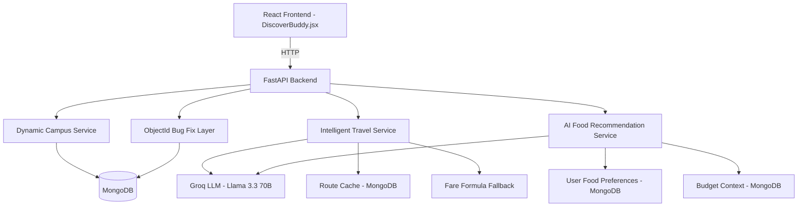
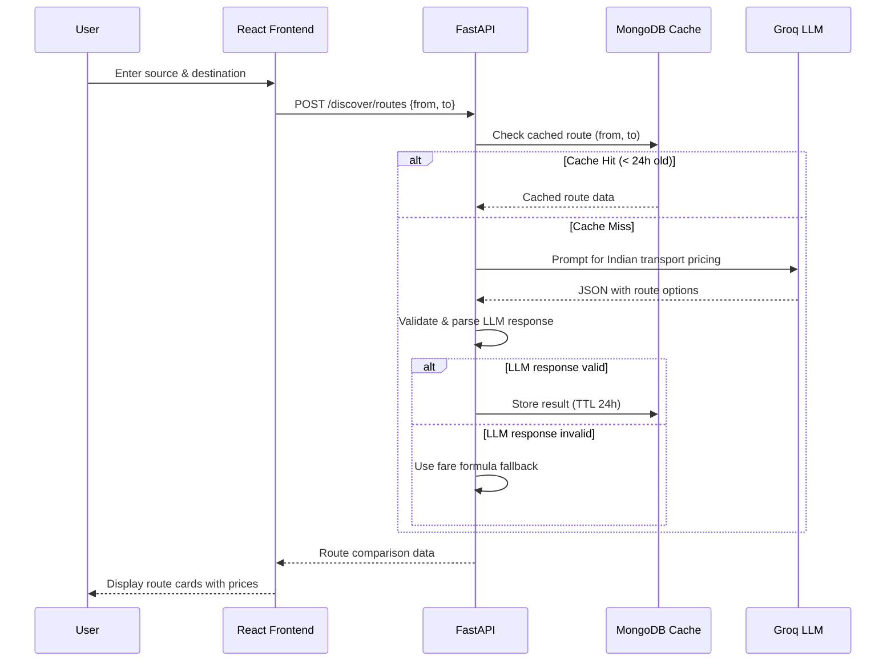
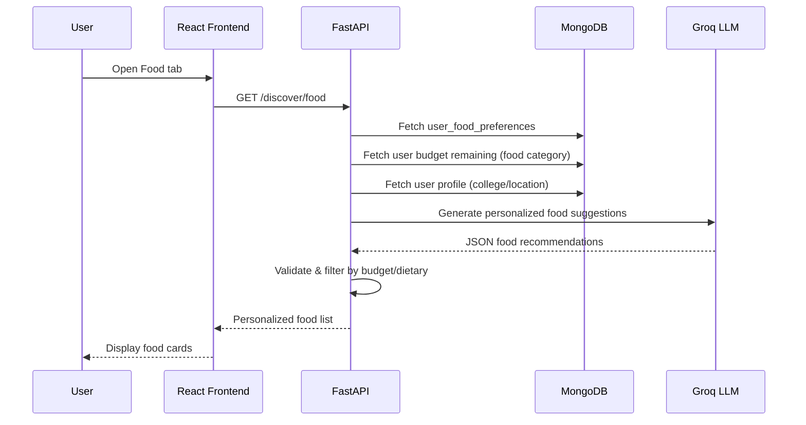

# Design Document: Intelligent Discover Module

## Overview

The Intelligent Discover Module transforms PocketBuddy's static "Discover Buddy" domain into an AI-powered, context-aware system for Indian college students. It addresses four key problems: (1) a MongoDB ObjectId serialization bug in the saved-places endpoint, (2) hardcoded travel routes with no real pricing, (3) static food recommendations that ignore user context, and (4) non-configurable campus resources.

The core approach leverages the existing Groq LLM integration (Llama 3.3 70B) to generate intelligent, location-aware travel cost estimates and personalized food recommendations. A caching layer minimizes redundant API calls. The frontend gains free-text source/destination input for travel and displays AI-generated route comparisons with realistic Indian transport pricing.

## Architecture



## Sequence Diagrams

### Travel Route Comparison Flow



### AI Food Recommendation Flow



## Components and Interfaces

### Component 1: ObjectId Bug Fix

**Purpose**: Prevent MongoDB `_id` (ObjectId) from leaking into FastAPI JSON responses.

**Interface**:
```python
def sanitize_mongo_doc(doc: dict) -> dict:
    """Remove _id field from a MongoDB document before returning to client."""
    ...
```

**Responsibilities**:
- Pop `_id` from documents after `insert_one()` calls
- Apply to `add_saved_place` and `add_campus_resource` endpoints

### Component 2: Intelligent Travel Service

**Purpose**: Generate real-world travel cost comparisons between any two Indian locations using LLM intelligence with fare formula fallback.

**Interface**:
```python
class TravelService:
    async def get_routes(self, source: str, destination: str, user_id: str) -> list[dict]:
        """Return route options with realistic pricing for Indian transport."""
        ...
    
    async def get_cached_route(self, source: str, destination: str) -> Optional[dict]:
        """Check MongoDB cache for previously computed routes."""
        ...
    
    async def estimate_via_llm(self, source: str, destination: str) -> list[dict]:
        """Use Groq LLM to estimate travel costs between locations."""
        ...
    
    def estimate_via_formula(self, distance_km: float) -> list[dict]:
        """Fallback: compute fares using known per-km rates."""
        ...
```

**Responsibilities**:
- Accept free-text source/destination (Indian cities, localities, landmarks)
- Query LLM for intelligent pricing estimates
- Cache results in MongoDB with 24-hour TTL
- Fall back to distance-based fare formulas when LLM fails
- Return structured route comparison data

### Component 3: AI Food Recommendation Service

**Purpose**: Generate personalized, context-aware food suggestions using LLM's real-world knowledge of restaurants and eateries near Indian colleges. All data is web-fetched via LLM — zero hardcoded food options.

**Interface**:
```python
class FoodRecommendationService:
    async def get_recommendations(self, user_id: str) -> list[dict]:
        """Generate AI-powered food recommendations from real-world data via LLM."""
        ...
    
    async def build_context(self, user_id: str) -> dict:
        """Gather user preferences, budget, location, and time context."""
        ...
```

**Responsibilities**:
- Gather user food preferences, budget remaining, location, and time of day
- Construct contextual prompt asking LLM for REAL restaurants/stalls in the user's area
- Parse and validate LLM food suggestions
- Filter results by dietary restrictions and budget
- Cache results per user+meal-time with 6-hour TTL
- Return structured food recommendation data
- On LLM failure: return empty list (NO hardcoded fallback)

### Component 4: Dynamic Campus Resources Service

**Purpose**: Serve configurable campus resources from MongoDB instead of hardcoded arrays.

**Interface**:
```python
async def get_campus_resources(user_id: str) -> list[dict]:
    """Retrieve campus resources from DB, seeding defaults if empty."""
    ...

async def seed_default_resources(user_id: str) -> None:
    """Seed default Indian college campus resources for new users."""
    ...
```

**Responsibilities**:
- Store campus resources in MongoDB per user
- Seed realistic defaults for Indian colleges on first access
- Support CRUD operations on resources
- Include real contact patterns (helpline numbers, timings)

## Data Models

### RouteOption

```python
from pydantic import BaseModel
from typing import Optional

class RouteOption(BaseModel):
    mode: str           # "Auto", "Metro", "Bus", "Ola/Uber", "Cycle Rickshaw", "Walk", "Train"
    cost: int           # Cost in ₹
    time: str           # Duration string e.g. "25 min", "2h 30min"
    distance: str       # Distance e.g. "3.5 km", "150 km"
    eco: bool           # Eco-friendly flag
    safe: bool          # Safety rating
    notes: Optional[str]  # Additional info e.g. "Peak hour surge +₹30"
```

**Validation Rules**:
- `cost` must be >= 0
- `mode` must be one of the known Indian transport modes
- `time` must be a parseable duration string

### RouteCache

```python
class RouteCache(BaseModel):
    source: str
    destination: str
    source_normalized: str   # Lowercase, trimmed
    destination_normalized: str
    routes: list[dict]
    created_at: str          # ISO timestamp
    expires_at: str          # ISO timestamp (created_at + 24h)
```

### FoodRecommendation

```python
class FoodRecommendation(BaseModel):
    name: str
    price: int              # Price in ₹
    rating: float           # 1.0 - 5.0
    distance: str           # Distance from user
    tag: str                # Category tag
    dietary: str            # "veg", "non-veg", "vegan"
    reason: str             # Why recommended (AI-generated)
    image: Optional[str]    # Image URL
```

### SavedPlace (Updated)

```python
class SavedPlace(BaseModel):
    id: str
    user_id: str
    name: str
    address: str
    type: str               # hostel, college, library, market, hospital, other
    city: Optional[str]     # City name for intercity routing
    created_at: str
```

## Key Functions with Formal Specifications

### Function 1: sanitize_mongo_doc()

```python
def sanitize_mongo_doc(doc: dict) -> dict:
    """Remove MongoDB _id from document."""
    doc.pop("_id", None)
    return doc
```

**Preconditions:**
- `doc` is a valid Python dictionary (may or may not contain `_id`)

**Postconditions:**
- Returned dict does NOT contain key `_id`
- All other key-value pairs are preserved unchanged
- Original dict is modified in-place and returned

**Loop Invariants:** N/A

### Function 2: TravelService.estimate_via_llm()

```python
async def estimate_via_llm(self, source: str, destination: str) -> list[dict]:
    """Query Groq LLM for realistic Indian transport pricing."""
    ...
```

**Preconditions:**
- `source` and `destination` are non-empty strings
- Groq API key is configured in environment
- LLM service is reachable

**Postconditions:**
- Returns a list of RouteOption dicts (may be empty on failure)
- Each route has `mode`, `cost` (int >= 0), `time`, `distance`, `eco`, `safe`
- Costs reflect realistic Indian transport pricing (₹)
- On LLM failure, returns empty list (caller uses fallback)

**Loop Invariants:** N/A

### Function 3: TravelService.estimate_via_formula()

```python
def estimate_via_formula(self, distance_km: float) -> list[dict]:
    """Compute fares using known Indian transport per-km rates."""
    ...
```

**Preconditions:**
- `distance_km` > 0

**Postconditions:**
- Returns list of route options with deterministic pricing
- Auto: ₹25 base + ₹15/km
- Bus: ₹5-10/km (use ₹7/km average)
- Metro: ₹10 base + ₹3/km (capped at ₹60)
- Ola/Uber: ₹50 base + ₹10/km
- Cycle Rickshaw: ₹20 base + ₹10/km (only for distance < 5km)
- Walk: ₹0 (only for distance < 3km)

**Loop Invariants:** N/A

### Function 4: FoodRecommendationService.get_recommendations()

```python
async def get_recommendations(self, user_id: str) -> list[dict]:
    """Generate AI food recommendations with user context via web-fetched LLM knowledge."""
    ...
```

**Preconditions:**
- `user_id` is a valid user identifier in the system
- Database is accessible
- LLM service is reachable (Groq API)

**Postconditions:**
- Returns list of FoodRecommendation dicts (4-8 items)
- All items are real-world restaurants/food stalls near the user's location (LLM-generated from its training data knowledge of Indian eateries)
- All items respect user's dietary preference
- All items have price <= user's budget_per_meal
- Items are sorted by relevance (AI-determined)
- On LLM failure, returns an empty list with an error flag (no hardcoded fallback)

**Loop Invariants:** N/A

## Algorithmic Pseudocode

### Route Estimation Algorithm

```python
async def get_routes(source: str, destination: str, user_id: str) -> dict:
    """
    Main algorithm for intelligent route comparison.
    
    INPUT: source location, destination location, user_id
    OUTPUT: dict with routes list, source, destination, saved_places
    """
    # Step 1: Normalize inputs
    source_norm = source.strip().lower()
    dest_norm = destination.strip().lower()
    
    # Step 2: Check cache
    cached = await db.route_cache.find_one({
        "source_normalized": source_norm,
        "destination_normalized": dest_norm,
        "expires_at": {"$gt": now_iso()}
    })
    
    if cached:
        return cached["routes"]
    
    # Step 3: Try LLM estimation
    routes = await estimate_via_llm(source, destination)
    
    # Step 4: Validate LLM response
    if not routes or not all(validate_route(r) for r in routes):
        # Step 5: Fallback to formula
        distance = estimate_distance_from_llm_or_default(source, destination)
        routes = estimate_via_formula(distance)
    
    # Step 6: Cache result
    await db.route_cache.insert_one({
        "source": source,
        "destination": destination,
        "source_normalized": source_norm,
        "destination_normalized": dest_norm,
        "routes": routes,
        "created_at": now_iso(),
        "expires_at": iso_plus_hours(24)
    })
    
    return routes
```

### LLM Prompt Strategy for Travel

```python
TRAVEL_SYSTEM_PROMPT = """You are a travel cost estimator for Indian locations.
Given a source and destination, estimate realistic travel costs in Indian Rupees (₹).

Return a JSON array of transport options. Each option must have:
- mode: transport type (Auto, Metro, Bus, Ola/Uber, Cycle Rickshaw, Walk, Train, Local Train)
- cost: estimated cost in ₹ (integer)
- time: estimated duration (e.g. "25 min", "1h 30min")
- distance: approximate distance (e.g. "3.5 km")
- eco: boolean (true for walking, cycling, metro, bus)
- safe: boolean (true for all except walking alone at night)
- notes: any relevant info (peak pricing, availability)

Only include modes that make sense for the given distance.
For intra-city (<15km): Auto, Metro, Bus, Ola/Uber, Cycle Rickshaw, Walk
For intercity (>15km): Bus, Train, Ola/Uber

Use realistic 2024 Indian pricing:
- Auto: ₹25 base + ₹15/km (varies by city)
- Ola/Uber: ₹50 base + ₹10/km (mini), surge possible
- Metro (where available): ₹10-60 depending on stations
- Bus: ₹5-10/km for city, ₹1-2/km for intercity
- Train: ₹1-2/km (sleeper), ₹2-4/km (AC)
- Cycle Rickshaw: ₹20 base + ₹10/km (short distances only)

Return ONLY valid JSON array, no markdown, no explanation."""

TRAVEL_USER_PROMPT = "Estimate travel costs from '{source}' to '{destination}' in India."
```

### LLM Prompt Strategy for Food Recommendations

```python
FOOD_SYSTEM_PROMPT = """You are a food recommendation engine for Indian college students.
Given the user's context, suggest 6 REAL food places/options that actually exist near their location.

You must recommend real restaurants, dhabas, canteens, street food stalls, and eateries 
that are commonly found near Indian colleges in the specified city/area. Use your knowledge 
of popular student food spots, local chains, and common eatery types in that area.

Return a JSON array. Each item must have:
- name: REAL restaurant/stall name or realistic local eatery name for that area
- price: realistic cost in ₹ (integer) for a student meal there
- rating: 3.5-5.0 (float) - realistic rating
- distance: realistic distance from the college area (e.g. "0.3 km")
- tag: category (e.g. "North Indian", "South Indian", "Chinese", "Street Food", "Healthy", "Quick Bite", "Cafe")
- dietary: "veg", "non-veg", or "vegan"
- reason: 1-sentence why this is good for a student right now
- type: "restaurant" | "street_food" | "canteen" | "cafe" | "dhaba" | "mess"

Important:
- Recommend REAL places known to exist in or near the specified area
- If you know specific popular student spots in that city, name them
- Include a mix: some very cheap (₹30-50), some moderate (₹60-100), some slightly premium (₹100-150)
- Factor in the time of day for relevance
- For breakfast: suggest idli/dosa spots, tea stalls, paratha shops
- For lunch: suggest thalis, rice meals, combo meals
- For evening: suggest snack spots, chaats, momos
- For dinner: suggest budget restaurants, dhabas, mess options

Return ONLY valid JSON array, no markdown, no explanation."""

FOOD_USER_PROMPT = """Recommend 6 REAL food options for a {dietary} student near {location} 
with budget ₹{budget} per meal. It's currently {time_of_day}. 
They prefer: {cuisines}. 
Suggest actual restaurants, stalls, or food types commonly available in this area."""
```

### Food Recommendation Algorithm

```python
async def get_recommendations(user_id: str) -> list[dict]:
    """
    Generate AI-powered food recommendations using web-fetched real-world data.
    NO hardcoded fallback — all food data comes from LLM's real-world knowledge.
    
    INPUT: user_id
    OUTPUT: list of FoodRecommendation dicts (real places)
    """
    # Step 1: Build context
    prefs = await db.user_food_preferences.find_one({"user_id": user_id})
    profile = await db.users.find_one({"user_id": user_id})
    
    dietary = (prefs or {}).get("dietary", "any")
    budget = (prefs or {}).get("budget_per_meal", 150)
    cuisines = (prefs or {}).get("cuisines", ["North Indian", "South Indian"])
    location = (profile or {}).get("college", (profile or {}).get("city", "a college in India"))
    
    hour = datetime.now().hour
    time_of_day = (
        "morning/breakfast" if hour < 11
        else "lunch" if hour < 15
        else "evening snack" if hour < 18
        else "dinner"
    )
    
    # Step 2: Check food recommendation cache (cache per user+time_of_day, 6h TTL)
    cache_key = f"{user_id}_{time_of_day}_{dietary}"
    cached = await db.food_recommendation_cache.find_one({
        "cache_key": cache_key,
        "expires_at": {"$gt": now_iso()}
    })
    if cached:
        return cached["recommendations"]
    
    # Step 3: Query LLM for REAL food places
    prompt = FOOD_USER_PROMPT.format(
        dietary=dietary, location=location,
        budget=budget, time_of_day=time_of_day,
        cuisines=", ".join(cuisines)
    )
    
    try:
        response = await call_llm_json(FOOD_SYSTEM_PROMPT, prompt)
        recommendations = json.loads(response)
        
        # Step 4: Validate and filter
        valid = [r for r in recommendations 
                 if r.get("price", 999) <= budget
                 and matches_dietary(r.get("dietary", "any"), dietary)]
        
        result = valid[:8]
        
        # Step 5: Cache results (6h TTL — food relevance changes by meal time)
        await db.food_recommendation_cache.insert_one({
            "cache_key": cache_key,
            "user_id": user_id,
            "recommendations": result,
            "created_at": now_iso(),
            "expires_at": iso_plus_hours(6),
        })
        
        return result
    except Exception:
        # NO hardcoded fallback — return empty with error flag
        return []
```

## Example Usage

```python
# Example 1: Fix ObjectId bug in add_saved_place
@api_router.post("/discover/saved-places")
async def add_saved_place(payload: Dict[str, Any], user_id: str = Depends(get_current_user)):
    place = {
        "id": str(uuid.uuid4()),
        "user_id": user_id,
        "name": name,
        "type": payload.get("type", "other"),
        "created_at": now_iso(),
    }
    await db.saved_places.insert_one(place)
    place.pop("_id", None)  # Fix: remove ObjectId before JSON serialization
    return place


# Example 2: Intelligent travel route query
@api_router.post("/discover/routes")
async def discover_routes(payload: Dict[str, Any], user_id: str = Depends(get_current_user)):
    source = payload.get("from", "").strip()
    destination = payload.get("to", "").strip()
    if not source or not destination:
        raise HTTPException(400, "Source and destination required")
    
    travel_service = TravelService(db)
    routes = await travel_service.get_routes(source, destination, user_id)
    places = await db.saved_places.find({"user_id": user_id}, {"_id": 0}).to_list(20)
    
    return {"routes": routes, "from": source, "to": destination, "saved_places": places}


# Example 3: AI food recommendations (fully web-fetched, no hardcoded data)
@api_router.get("/discover/food")
async def discover_food(user_id: str = Depends(get_current_user)):
    food_service = FoodRecommendationService(db)
    recommendations = await food_service.get_recommendations(user_id)
    if not recommendations:
        # LLM failed — return error flag so frontend shows retry UI
        return {"items": [], "error": "Unable to fetch recommendations. Please try again."}
    return {"items": recommendations, "error": None}


# Example 4: LLM helper function (non-streaming for JSON responses)
async def call_llm_json(system_prompt: str, user_prompt: str) -> str:
    """Call Groq LLM and collect full response text."""
    llm = LlmChat(
        api_key=os.getenv("GROQ_API_KEY", ""),
        session_id="discover-service",
        system_message=system_prompt,
        temperature=0.3,  # Lower temperature for structured output
        max_tokens=2048,
        cache_enabled=True,
    ).with_model("groq", "llama-3.3-70b-versatile")
    
    full_text = ""
    async for event in llm.stream_message(UserMessage(text=user_prompt)):
        if isinstance(event, TextDelta):
            full_text += event.content
        elif isinstance(event, StreamDone):
            break
    
    return full_text
```

## Correctness Properties

*A property is a characteristic or behavior that should hold true across all valid executions of a system — essentially, a formal statement about what the system should do. Properties serve as the bridge between human-readable specifications and machine-verifiable correctness guarantees.*

### Property 1: ObjectId Exclusion and Field Preservation

*For any* dictionary passed to `sanitize_mongo_doc`, the returned dict SHALL NOT contain a key named `_id`, AND all other key-value pairs SHALL be preserved unchanged.

**Validates: Requirements 1.1, 1.2, 1.3, 4.3**

### Property 2: Fare Formula Non-Negativity and Determinism

*For any* positive distance value, the fare formula SHALL produce route options where every `cost` field is >= 0, AND calling it twice with the same distance SHALL produce identical results.

**Validates: Requirements 2.6**

### Property 3: Fare Formula Mode Appropriateness

*For any* distance > 5km, `estimate_via_formula` SHALL NOT include "Cycle Rickshaw" as a mode. For any distance > 3km, it SHALL NOT include "Walk" as a mode. For any distance <= 3km, Walk SHALL be included with cost 0.

**Validates: Requirements 2.6**

### Property 4: Cache Round-Trip Consistency

*For any* route query that is cached, a subsequent identical query (same normalized source and destination) within the TTL period SHALL return the same route data.

**Validates: Requirements 2.3, 2.8**

### Property 5: Dietary Filter Correctness

*For any* food recommendation list and any user dietary preference, filtering SHALL exclude all items whose `dietary` field does not match the user's preference (veg users see only veg/vegan; vegan users see only vegan; non-veg and any users see all).

**Validates: Requirements 3.4**

### Property 6: Budget Filter Correctness

*For any* food recommendation list and any budget value, filtering SHALL exclude all items whose `price` exceeds the user's `budget_per_meal`.

**Validates: Requirements 3.3**

### Property 7: Empty/Whitespace Input Rejection

*For any* string composed entirely of whitespace (or empty), submitting it as source or destination to `POST /discover/routes` SHALL result in HTTP 400 rejection.

**Validates: Requirements 2.7**

## Error Handling

### Error Scenario 1: LLM Unavailable for Travel

**Condition**: Groq API returns error or times out during route estimation
**Response**: System uses deterministic fare formula fallback based on estimated distance
**Recovery**: Next request re-attempts LLM; cache prevents repeated failures for same query

### Error Scenario 2: LLM Returns Invalid JSON

**Condition**: LLM response cannot be parsed as valid JSON or doesn't match expected schema
**Response**: System falls back to fare formula estimation
**Recovery**: Invalid responses are not cached; next request re-tries LLM

### Error Scenario 3: ObjectId Serialization (Current Bug)

**Condition**: MongoDB `insert_one()` mutates dict by adding `_id` field (ObjectId type)
**Response**: Pop `_id` from document before returning to FastAPI for JSON serialization
**Recovery**: N/A (preventive fix)

### Error Scenario 4: Empty/Invalid Source or Destination

**Condition**: User submits empty or whitespace-only source/destination
**Response**: Return HTTP 400 with descriptive error message
**Recovery**: Frontend validates before submitting; backend validates as safety net

### Error Scenario 5: LLM Unavailable for Food

**Condition**: Groq API fails during food recommendation generation
**Response**: Return empty list with error flag — frontend displays "Unable to fetch recommendations, please try again" with retry button. NO hardcoded fallback.
**Recovery**: Next request re-attempts LLM; cached results serve immediately when available

## Testing Strategy

### Unit Testing Approach

- Test `sanitize_mongo_doc` with various dict shapes (with/without `_id`)
- Test fare formula calculations for known distances
- Test dietary and budget filtering logic
- Test LLM response parsing and validation
- Test cache TTL expiry logic
- Test route mode filtering by distance

### Property-Based Testing Approach

**Property Test Library**: hypothesis (Python)

- Generate random documents and verify `_id` is never in output
- Generate random distances and verify fare formula produces valid, non-negative costs
- Generate random food preferences and verify dietary filtering is correct
- Generate random route results and verify mode-distance constraints

### Integration Testing Approach

- Test full route estimation flow with mocked LLM responses
- Test cache hit/miss behavior
- Test fallback from LLM failure to formula
- Test end-to-end saved place creation without ObjectId leak

## Performance Considerations

- **LLM Latency**: Groq API calls take 1-3 seconds; cached routes serve instantly
- **Cache TTL**: 24-hour cache for route prices (prices don't change frequently for common routes)
- **Concurrency**: FastAPI async handlers allow concurrent LLM requests
- **Response Size**: LLM responses are small (< 2KB JSON); no streaming needed for structured data
- **Temperature**: Use 0.3 for travel (more deterministic pricing) and 0.5 for food (more variety)

## Security Considerations

- **Input Sanitization**: Strip and validate source/destination before passing to LLM prompt
- **LLM Injection Prevention**: Source/destination are embedded in structured prompts, not as raw system instructions
- **API Key Protection**: GROQ_API_KEY stays in `.env`, never exposed to frontend
- **Rate Limiting**: Cache reduces LLM calls; existing FastAPI rate limiting applies

## Dependencies

- **Existing**: FastAPI, Motor (async MongoDB), Groq API via `emergentintegrations.llm.chat`
- **No new external dependencies** beyond what's already installed
- **MongoDB Collections** (new): `route_cache` (for travel caching), `food_recommendation_cache` (for food caching, 6h TTL)
- **MongoDB Collections** (existing): `saved_places`, `user_food_preferences`, `campus_resources`, `users`
