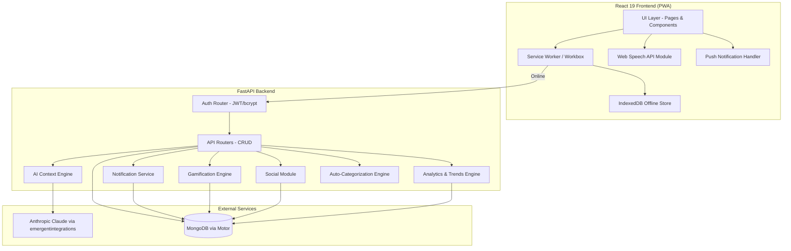
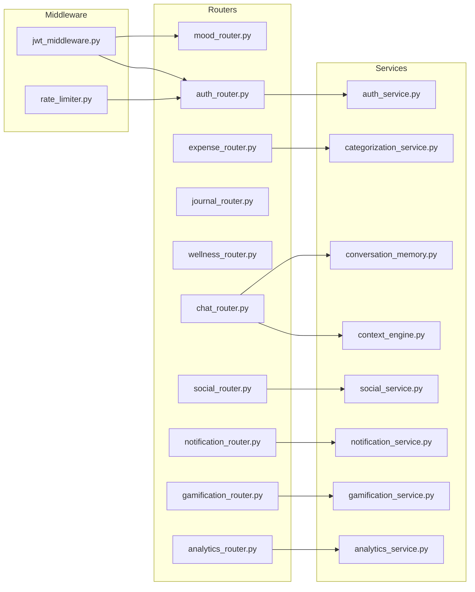
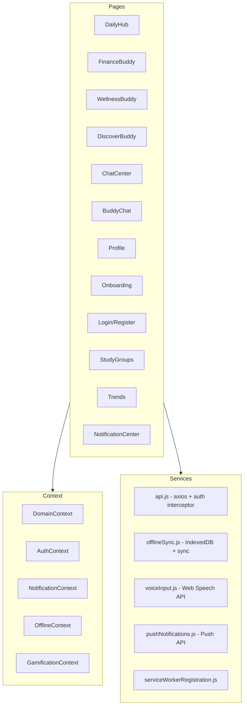

# Design Document: PocketBuddy AI Enhancement

## Overview

This design enhances the PocketBuddy student super-app from a prototype with demo-seeded data and basic CRUD into a production-ready, AI-powered personal assistant. The enhancement spans 13 requirement areas: cross-domain AI context, voice input, smart notifications, gamification, social features, analytics, offline/PWA support, authentication, conversation memory, daily insights, expense auto-categorization, UI component integration, and holistic UI/UX coherence.

The system architecture extends the existing FastAPI + MongoDB + React stack while introducing new subsystems for authentication, notifications, gamification, social interactions, offline sync, and enhanced AI context assembly. All AI features continue using the `emergentintegrations` library with Anthropic Claude models.

### Key Design Decisions

1. **Monolithic Backend Extension**: Rather than splitting into microservices, we extend the existing `server.py` with well-separated router modules. This keeps deployment simple for a hackathon/student project while maintaining clear separation of concerns via Python modules.

2. **JWT Auth with Middleware**: Authentication wraps all existing endpoints transparently. The current `DEMO_USER` pattern is replaced with JWT-derived user IDs from request middleware.

3. **Service Worker for PWA**: A Workbox-generated service worker handles caching and offline sync with IndexedDB as the local store.

4. **In-App Notification Model**: Notifications are stored as MongoDB documents and delivered via in-app polling + optional Push API. No external notification service dependency.

5. **Gamification as Event-Driven Middleware**: XP/streak/achievement logic hooks into existing create endpoints rather than requiring a separate engine.

## Architecture

### High-Level System Diagram



### Backend Module Architecture



### Frontend Module Architecture



## Components and Interfaces

### Backend API Endpoints (New/Modified)

#### Authentication Module (`/api/auth/*`)

| Endpoint | Method | Description |
|----------|--------|-------------|
| `/api/auth/register` | POST | Create account with email + password |
| `/api/auth/login` | POST | Authenticate, return JWT + refresh token |
| `/api/auth/refresh` | POST | Exchange refresh token for new access token |
| `/api/auth/forgot-password` | POST | Send password reset email |
| `/api/auth/reset-password` | POST | Reset password with token |
| `/api/auth/delete-account` | DELETE | Permanently delete account + all data |
| `/api/auth/export-data` | GET | Export all user data as JSON |

#### Notification Module (`/api/notifications/*`)

| Endpoint | Method | Description |
|----------|--------|-------------|
| `/api/notifications` | GET | List user's recent notifications (limit 20) |
| `/api/notifications/{id}/dismiss` | POST | Dismiss a notification |
| `/api/notifications/preferences` | GET/PATCH | Get/update notification preferences |
| `/api/notifications/subscribe` | POST | Register push subscription |

#### Gamification Module (`/api/gamification/*`)

| Endpoint | Method | Description |
|----------|--------|-------------|
| `/api/gamification/status` | GET | Current XP, level, streak, achievements |
| `/api/gamification/achievements` | GET | All earned/available achievements |
| `/api/gamification/leaderboard` | GET | Group leaderboard for shared goals |

#### Social Module (`/api/social/*`)

| Endpoint | Method | Description |
|----------|--------|-------------|
| `/api/social/groups` | GET/POST | List/create study groups |
| `/api/social/groups/{id}` | GET | Group details, members, activity |
| `/api/social/groups/{id}/join` | POST | Join group with invite code |
| `/api/social/groups/{id}/leave` | POST | Leave group |
| `/api/social/groups/{id}/goals` | GET/POST | Shared goals in a group |
| `/api/social/challenges` | GET | Active weekly community challenges |
| `/api/social/challenges/{id}/join` | POST | Opt into a challenge |

#### Analytics Module (`/api/analytics/*`)

| Endpoint | Method | Description |
|----------|--------|-------------|
| `/api/analytics/trends` | GET | Trend lines for selected metrics/timerange |
| `/api/analytics/anomalies` | GET | Detected spending anomalies |
| `/api/analytics/monthly-report` | GET | Monthly financial health report |
| `/api/analytics/recovery-plan` | GET | Personalized habit recovery suggestions |

#### Enhanced Existing Endpoints

| Endpoint | Method | Changes |
|----------|--------|---------|
| `/api/chat/{buddy}` | POST | Add cross-domain context, conversation memory |
| `/api/expenses` | POST | Trigger gamification XP, apply user categorization rules |
| `/api/mood` | POST | Trigger gamification XP, streak check, nudge evaluation |
| `/api/journal` | POST | Trigger gamification XP |
| `/api/life-balance` | GET | Enhanced with 5-domain radar (Finance, Wellness, Academics, Social, Self-Care) |
| `/api/insights/daily` | GET | AI-generated from real user data, not hardcoded |
| `/api/wellness/phq2` | POST | New: persist PHQ-2 questionnaire responses |
| `/api/sleep/bedtime-goal` | POST | New: set bedtime goal |

### Frontend Components (New)

#### Auth Components
- `LoginPage.jsx` — Email/password login form with validation
- `RegisterPage.jsx` — Registration form with password requirements display
- `ForgotPasswordPage.jsx` — Email input for reset link
- `AuthContext.jsx` — JWT storage, refresh logic, auth state

#### Notification Components
- `NotificationCenter.jsx` — Sheet/drawer showing recent notifications
- `NotificationBell.jsx` — Header bell icon with unread badge count
- `NotificationPreferences.jsx` — Toggle switches per category

#### Gamification Components
- `XPProgressBar.jsx` — Animated XP bar with level indicator
- `StreakCounter.jsx` — Streak days display with flame animation
- `AchievementBadge.jsx` — Badge card with icon + description
- `LevelUpOverlay.jsx` — Full-screen celebration animation on level-up
- `GamificationSection.jsx` — Profile page section aggregating XP/streaks/badges

#### Social Components
- `StudyGroupCard.jsx` — Group preview card with member avatars
- `GroupDetail.jsx` — Members, shared goals, activity feed
- `InviteCodeInput.jsx` — 6-character code entry
- `SharedGoalLeaderboard.jsx` — Progress leaderboard per goal
- `CommunityChallenges.jsx` — List of active challenges

#### Voice Input
- `VoiceInputButton.jsx` — Mic button with recording indicator animation

#### Offline/PWA
- `OfflineIndicator.jsx` — Header banner showing offline status
- `SyncStatus.jsx` — Sync progress indicator
- `ConflictResolution.jsx` — Modal for resolving sync conflicts

#### Analytics
- `TrendsView.jsx` — Interactive charts with time range selector
- `AnomalyFlag.jsx` — Inline spending anomaly indicator
- `MonthlyReport.jsx` — Financial health report card

#### Enhanced Existing
- `DailyHub.jsx` — Add radar chart (5-domain), AI-generated insight cards from real data, "Tomorrow's Plan" card
- `Profile.jsx` — Add gamification section, data export, account deletion
- `Header.jsx` — Add notification bell, offline indicator

### Service Layer (Frontend)

```javascript
// offlineSync.js - Key interface
export const offlineStore = {
  save(collection, entry) {},       // Save to IndexedDB
  getAll(collection) {},            // Get pending entries
  getCount() {},                    // Total offline entries
  clear(collection) {},             // Clear after sync
  sync() {},                        // Push all to server
};

// voiceInput.js - Key interface
export const voiceInput = {
  isSupported() {},                 // Check Web Speech API support
  start(onTranscript, onError) {},  // Begin recording
  stop() {},                        // Stop recording
};

// pushNotifications.js - Key interface
export const pushNotifications = {
  requestPermission() {},           // Request browser permission
  subscribe(userId) {},             // Register with backend
  isEnabled() {},                   // Check current state
};
```

## Data Models

### New MongoDB Collections

#### `users` Collection
```json
{
  "_id": "ObjectId",
  "id": "uuid",
  "email": "string (unique, max 254 chars)",
  "password_hash": "string (bcrypt, cost 12)",
  "created_at": "ISO datetime",
  "updated_at": "ISO datetime",
  "last_login_at": "ISO datetime",
  "failed_login_attempts": "int (0-5)",
  "locked_until": "ISO datetime | null",
  "refresh_token_hash": "string | null",
  "push_subscription": "object | null"
}
```

#### `notifications` Collection
```json
{
  "_id": "ObjectId",
  "id": "uuid",
  "user_id": "string",
  "type": "string (budget_warning | wellness_nudge | streak_celebration | social_update | reminder)",
  "title": "string",
  "body": "string",
  "category": "string",
  "read": "boolean",
  "dismissed": "boolean",
  "created_at": "ISO datetime",
  "metadata": {
    "category_name": "string | null",
    "spent_pct": "number | null",
    "streak_count": "number | null",
    "xp_earned": "number | null"
  }
}
```

#### `notification_preferences` Collection
```json
{
  "user_id": "string",
  "budget_alerts": "boolean (default true)",
  "wellness_reminders": "boolean (default true)",
  "streak_celebrations": "boolean (default true)",
  "social_updates": "boolean (default true)",
  "suppressed_types": [
    { "type": "string", "until": "ISO datetime" }
  ]
}
```

#### `gamification` Collection
```json
{
  "_id": "ObjectId",
  "user_id": "string (unique)",
  "total_xp": "int (default 0)",
  "level": "int (computed: floor(xp/100)+1)",
  "streak_days": "int",
  "last_checkin_date": "string (YYYY-MM-DD) | null",
  "achievements": [
    { "id": "string", "name": "string", "earned_at": "ISO datetime" }
  ],
  "daily_xp_log": {
    "mood_checkin": "boolean",
    "journal_entry": "boolean",
    "expense_count": "int (max 10)"
  },
  "daily_xp_date": "string (YYYY-MM-DD)"
}
```

#### `study_groups` Collection
```json
{
  "_id": "ObjectId",
  "id": "uuid",
  "name": "string",
  "invite_code": "string (6 alphanum, unique)",
  "creator_id": "string",
  "members": [
    { "user_id": "string", "display_name": "string", "level": "int", "joined_at": "ISO datetime" }
  ],
  "created_at": "ISO datetime",
  "max_members": 20
}
```

#### `shared_goals` Collection
```json
{
  "id": "uuid",
  "group_id": "string",
  "title": "string",
  "target": "number",
  "created_by": "string",
  "progress": [
    { "user_id": "string", "display_name": "string", "current": "number", "updated_at": "ISO datetime" }
  ]
}
```

#### `community_challenges` Collection
```json
{
  "id": "uuid",
  "title": "string",
  "description": "string",
  "type": "string (finance | wellness | productivity)",
  "criteria": "object",
  "start_date": "ISO datetime (Monday 00:00 UTC)",
  "end_date": "ISO datetime (Sunday 23:59 UTC)",
  "participants": [
    { "user_id": "string", "completed": "boolean", "progress": "number" }
  ],
  "badge_id": "string",
  "xp_reward": 50
}
```

#### `user_category_rules` Collection
```json
{
  "user_id": "string",
  "merchant_lower": "string (lowercase merchant name)",
  "category": "string",
  "updated_at": "ISO datetime"
}
```
*Compound unique index on `(user_id, merchant_lower)`. Max 500 rules per user.*

#### `conversation_summaries` Collection
```json
{
  "user_id": "string",
  "buddy": "string (finance|wellness|discover|helper)",
  "summary": "string (max 500 chars)",
  "updated_at": "ISO datetime"
}
```

### Modified Existing Collections

#### `user_profiles` — Additional Fields
```json
{
  "...existing fields...",
  "notification_preferences": "object (reference)",
  "timezone": "string (IANA timezone, e.g. 'Asia/Kolkata')",
  "emergency_contact": "string | null"
}
```

#### `chat_messages` — No Schema Change
Existing schema is sufficient. Retention policy: keep last 50 per buddy, summarize older messages into `conversation_summaries`.

#### `mood_entries` — No Schema Change
Used by gamification service to compute streaks and daily check-in XP.

### Pydantic Models (Backend)

```python
# auth_models.py
class RegisterRequest(BaseModel):
    email: str = Field(max_length=254)
    password: str = Field(min_length=8, max_length=128)

class LoginRequest(BaseModel):
    email: str
    password: str

class TokenResponse(BaseModel):
    access_token: str
    refresh_token: str
    token_type: str = "bearer"
    expires_in: int = 86400  # 24 hours

# gamification_models.py
class GamificationStatus(BaseModel):
    user_id: str
    total_xp: int = 0
    level: int = 1
    streak_days: int = 0
    achievements: List[dict] = []

class XPEvent(BaseModel):
    action: str  # mood_checkin, expense_log, journal_entry, streak_bonus, challenge_complete
    xp: int
    timestamp: str

# notification_models.py
class Notification(BaseModel):
    id: str = Field(default_factory=lambda: str(uuid.uuid4()))
    user_id: str
    type: str
    title: str
    body: str
    category: str
    read: bool = False
    dismissed: bool = False
    created_at: str = Field(default_factory=now_iso)
    metadata: Dict[str, Any] = {}

# social_models.py
class StudyGroup(BaseModel):
    id: str = Field(default_factory=lambda: str(uuid.uuid4()))
    name: str
    invite_code: str = Field(default_factory=lambda: generate_invite_code())
    creator_id: str
    members: List[dict] = []
    created_at: str = Field(default_factory=now_iso)

class SharedGoal(BaseModel):
    id: str = Field(default_factory=lambda: str(uuid.uuid4()))
    group_id: str
    title: str
    target: float
    created_by: str
    progress: List[dict] = []
```

## Correctness Properties

*A property is a characteristic or behavior that should hold true across all valid executions of a system — essentially, a formal statement about what the system should do. Properties serve as the bridge between human-readable specifications and machine-verifiable correctness guarantees.*

### Property 1: Cross-Domain Context Assembly Completeness

*For any* user with data across multiple domains (mood, expenses, sleep, goals), when the AI context engine assembles a conversation context, the resulting context object SHALL include all available data from the last 7 days for each domain that has entries.

**Validates: Requirements 1.1**

### Property 2: Correlation Threshold Detection

*For any* user data state where stress score exceeds 70 AND food spending increased >30% compared to the prior 7-day period, OR where sleep average is below 6 hours for 3 consecutive days AND task completion rate is below 50%, the Cross_Domain_Engine SHALL produce the corresponding correlation insight (emotional-eating or burnout-risk respectively).

**Validates: Requirements 1.2, 1.3**

### Property 3: Computed Scores Satisfy Domain Constraints

*For any* user data state, the unified context object SHALL contain: financial_health_score (integer 0–100), wellness_composite_score (integer 0–100), habit_consistency_percentage (integer 0–100), and active_stressors (list with at most 10 items). The life-balance radar SHALL produce exactly 5 domain scores, each an integer between 0 and 100 inclusive.

**Validates: Requirements 1.4, 10.1**

### Property 4: Conditional Wellness Context Inclusion

*For any* user whose stress score exceeds 60 OR whose sleep average is below 6.5 hours in the last 7 days, when the Finance Buddy receives a message, the prompt context sent to the AI model SHALL include the relevant wellness data point (stress score or sleep average).

**Validates: Requirements 1.5**

### Property 5: Data Sufficiency Guard for Correlations

*For any* user with fewer than 3 days of data across all domains, the Cross_Domain_Engine SHALL NOT produce any cross-domain correlation insights.

**Validates: Requirements 1.7**

### Property 6: Voice Transcript Length Cap

*For any* existing journal text and any new voice transcript, the combined result after appending SHALL NOT exceed 5000 characters total; if the combination would exceed 5000 characters, the transcript SHALL be truncated to fit within the limit.

**Validates: Requirements 2.3**

### Property 7: Notification Threshold Triggers

*For any* budget category where spent amount reaches or exceeds 80% of allocated amount, a budget warning nudge SHALL be generated containing the category name, current spent percentage, and remaining amount. *For any* user whose burnout score drops below 40, a wellness nudge SHALL be generated. *For any* user with no mood check-in before 10 PM local time, a reminder nudge SHALL be generated. *For any* streak reaching a milestone value (7, 14, 30, 60, 90 days), a celebration notification SHALL be generated with the streak count and earned XP.

**Validates: Requirements 3.1, 3.2, 3.3, 3.4**

### Property 8: High-Stress Notification Rate Limit

*For any* user whose stress score exceeds 70 for 2 consecutive days, the total number of nudges delivered per calendar day SHALL NOT exceed 3.

**Validates: Requirements 3.5**

### Property 9: Dismissal-Based Frequency Adaptation

*For any* nudge type that a user dismisses 3 or more times within a 7-day window, that nudge type SHALL be suppressed for the subsequent 14 days. *For any* single dismissal, the frequency of that nudge type SHALL be reduced by 50% for the following 7 days.

**Validates: Requirements 3.7**

### Property 10: XP Award Rules with Daily Caps

*For any* sequence of user actions within a single calendar day: mood check-ins SHALL award 10 XP for the first occurrence only, expense logs SHALL award 5 XP each for up to 10 occurrences (50 XP maximum), and journal entries SHALL award 10 XP for the first occurrence only. Subsequent actions beyond these caps SHALL award 0 XP.

**Validates: Requirements 4.1, 4.2, 4.3**

### Property 11: Streak Bonus Formula

*For any* active streak of N consecutive days, the daily streak bonus SHALL equal min(N × 2, 100) XP. *For any* user who does not complete a mood check-in before 11:59 PM local time, the streak SHALL reset to 0.

**Validates: Requirements 4.4**

### Property 12: Level Computation

*For any* XP total value T, the user's level SHALL equal floor(T / 100) + 1.

**Validates: Requirements 4.5**

### Property 13: Invite Code Format and Group Capacity

*For any* newly created study group, the invite code SHALL be exactly 6 alphanumeric characters. *For any* study group with 20 members, additional join attempts SHALL be rejected.

**Validates: Requirements 5.1**

### Property 14: Leaderboard Sort Order

*For any* shared goal with multiple participants, the leaderboard SHALL be sorted by completion percentage in descending order.

**Validates: Requirements 5.4**

### Property 15: Milestone Broadcast to Group Members

*For any* group member whose shared goal progress crosses a milestone threshold (25%, 50%, 75%, or 100%), a notification SHALL be created for every other member in the group containing the completing member's display name and the milestone reached.

**Validates: Requirements 5.5**

### Property 16: Group Privacy Enforcement

*For any* group member view or group API response, the visible data per member SHALL be limited to display_name, level, and shared goal progress. Financial amounts, mood details, journal entries, and other personal data SHALL NOT be included.

**Validates: Requirements 5.8**

### Property 17: Leave Group Data Integrity

*For any* user who leaves a study group, they SHALL be removed from the group member list and all shared goal leaderboards. Their personal XP total and earned badges SHALL remain unchanged after departure.

**Validates: Requirements 5.9**

### Property 18: Trend Computation Data Sufficiency

*For any* metric, weekly trends SHALL only be computed when at least 7 days of data exist, and monthly trends SHALL only be computed when at least 28 days of data exist. When fewer than 30 days exist for a trend comparison, the system SHALL use all available data and indicate the actual number of days used.

**Validates: Requirements 6.1, 6.2**

### Property 19: Spending Anomaly Threshold Detection

*For any* daily expense total that exceeds 2× the user's 30-day daily average, an anomaly SHALL be flagged containing the anomalous amount, the 30-day daily average, and the percentage deviation.

**Validates: Requirements 6.3**

### Property 20: Habit Decline Triggers Recovery Plan

*For any* tracked habit whose consistency drops below 40% for 2 consecutive weeks (14 days), a personalized recovery plan SHALL be generated containing at most 3 specific schedule adjustments.

**Validates: Requirements 6.5**

### Property 21: Offline Storage Capacity Cap

*For any* sequence of offline data entries, the system SHALL store entries in IndexedDB up to a maximum of 500. When the 500-entry limit is reached, additional entries SHALL be rejected until sync completes.

**Validates: Requirements 7.2, 7.8**

### Property 22: Sync Conflict Dual Preservation

*For any* sync conflict where the same record was modified both locally and on the server, the system SHALL preserve both versions and present them to the user with timestamp and source (local vs server) for each version.

**Validates: Requirements 7.4**

### Property 23: Registration Validation

*For any* registration attempt, the email SHALL be validated as standard email format (max 254 characters) and the password SHALL require minimum 8 characters, maximum 128 characters, at least one uppercase letter, and at least one number. Valid inputs SHALL produce an account with bcrypt-hashed password (cost factor 12) and a JWT with 24-hour expiration.

**Validates: Requirements 8.1, 8.2**

### Property 24: Authentication Enforcement

*For any* authenticated API endpoint, a request without a valid JWT token SHALL receive a 401 Unauthorized response.

**Validates: Requirements 8.4**

### Property 25: Login Rate Limiting

*For any* email address, after 5 failed login attempts within a 15-minute window, login SHALL be temporarily locked for that email for 15 minutes. All login failure responses SHALL use a generic error message without revealing whether the email or password was incorrect.

**Validates: Requirements 8.9**

### Property 26: Conversation Memory Retention and Summarization

*For any* buddy conversation exceeding 50 messages, messages older than the most recent 20 SHALL be summarized into a single context note of at most 500 characters. Only the 20 most recent full messages SHALL be retained alongside the summary.

**Validates: Requirements 9.1, 9.5**

### Property 27: Context Loading from History

*For any* buddy conversation with existing history when the user sends a message in a new session, the system SHALL include exactly the last 5 messages (ordered chronologically) from stored history as context in the AI prompt.

**Validates: Requirements 9.2**

### Property 28: Daily Insight Card Count

*For any* user data state (with at least some data), the system SHALL generate exactly 3 daily insight cards: one financial tip, one wellness suggestion, and one productivity recommendation.

**Validates: Requirements 10.2**

### Property 29: Low-Score Domain Actionable Step Length

*For any* domain scoring below 40 on the life-balance radar, the system SHALL provide an actionable step that is at most 140 characters long.

**Validates: Requirements 10.3**

### Property 30: Tomorrow's Plan Ordering

*For any* request for Tomorrow's Plan (after 8 PM local time), the system SHALL return exactly 3 actions ordered by the domain with the lowest life-balance score first (ascending score order).

**Validates: Requirements 10.4**

### Property 31: Partial Data Score Computation

*For any* user with fewer than 7 days of tracked data for a domain, the life-balance score SHALL be computed using only the available days of data and SHALL include an indicator noting the number of days used.

**Validates: Requirements 10.6**

### Property 32: Categorization Rule Round-Trip

*For any* expense category correction by a user, a rule mapping the merchant name (case-insensitive) to the new category SHALL be stored. *For any* subsequent expense with a merchant name matching a stored rule (case-insensitive), the user-specific category SHALL be applied. *For any* re-correction to a different category, the existing rule SHALL be overwritten with the new category.

**Validates: Requirements 11.1, 11.2, 11.5**

### Property 33: Category Rules Capacity Cap

*For any* user, the merchant-to-category mapping table SHALL support up to 500 stored rules. Attempts to add rules beyond 500 SHALL either overwrite existing rules (for the same merchant) or be rejected.

**Validates: Requirements 11.3**

### Property 34: Default Category Fallback

*For any* new expense whose merchant matches no user-specific rule and no keyword-based rule, the system SHALL assign the category "misc".

**Validates: Requirements 11.4**


## Error Handling

### Backend Error Strategy

| Error Category | HTTP Code | Behavior |
|---------------|-----------|----------|
| Invalid input (validation) | 400 | Return field-level errors with descriptive messages |
| Authentication failure | 401 | Generic "Invalid credentials" message, no field hints |
| Authorization failure | 403 | "Access denied" with no resource details |
| Resource not found | 404 | "Resource not found" |
| Rate limited | 429 | "Too many requests. Try again in X minutes" |
| Server error | 500 | Log full error, return generic "Something went wrong" |
| AI service timeout | 504 | Return cached/fallback response, log timeout |

### AI Service Degradation

```python
# Fallback strategy for AI failures
async def generate_with_fallback(prompt, fallback_fn):
    try:
        response = await ai_generate(prompt, timeout=10)
        return response
    except (TimeoutError, APIError) as e:
        logger.warning(f"AI generation failed: {e}")
        return fallback_fn()  # Return pre-computed or template-based response
```

- **Wellness cards**: Fall back to 2 generic motivational/plan cards (existing pattern in server.py)
- **Daily insights**: Fall back to template-based insights referencing recent data
- **Chat**: Return error message to user, suggest trying again
- **Cross-domain context**: Proceed with available data, skip failed domain

### Frontend Error Handling

1. **API errors**: All axios calls wrapped in try/catch. Errors displayed via toast or inline error component with retry button. Never show raw status codes or stack traces.
2. **Offline detection**: `navigator.onLine` + periodic heartbeat to `/api/`. On offline detection, route requests through IndexedDB offline store.
3. **Voice API errors**: Gracefully degrade — hide voice button if unsupported, show user-friendly messages for permission denial or recognition failure.
4. **Auth token expiry**: Axios interceptor catches 401, attempts refresh. If refresh fails, redirect to login.
5. **IndexedDB quota**: Monitor entry count. At 500, show warning and block new offline entries.

### Data Consistency

- **Optimistic updates**: UI updates immediately on user action, reverts if API call fails.
- **Conflict resolution**: For offline sync conflicts, present both versions to user with timestamps. User selects preferred version.
- **Idempotency**: XP awards use daily date keys to prevent double-awarding on retry.
- **Streak computation**: Always computed server-side from mood entries to prevent client-side manipulation.

## Testing Strategy

### Testing Framework Selection

- **Backend**: `pytest` + `pytest-asyncio` for async FastAPI testing, `httpx` for test client
- **Frontend**: Jest (via CRA/craco) + React Testing Library for component tests
- **Property-Based Testing**: `hypothesis` (Python) for backend property tests
- **E2E**: Playwright for critical user flows (optional, recommended for auth + offline)

### Dual Testing Approach

#### Unit Tests (Example-Based)
Focus on specific scenarios, edge cases, and integration points:

- Auth flows: registration, login, token refresh, password reset
- UI rendering: empty states, loading states, error states
- Voice input: browser support detection, permission handling
- Offline: connectivity detection, sync triggers
- Gamification: achievement unlock conditions
- Social: invalid invite codes, group at capacity

#### Property-Based Tests (Hypothesis)
Focus on universal properties verified across many generated inputs:

**Configuration**: Minimum 100 iterations per property test.

**Tag format**: `Feature: pocketbuddy-ai-enhancement, Property {N}: {title}`

Properties to implement as PBT:

1. **Context assembly** (Properties 1, 3, 4, 5) — Generate random user data, verify context shape/bounds
2. **Correlation detection** (Property 2) — Generate threshold-crossing data, verify insight generation
3. **Notification triggers** (Properties 7, 8, 9) — Generate random states, verify trigger logic
4. **XP computation** (Properties 10, 11, 12) — Generate action sequences, verify XP/level math
5. **Social invariants** (Properties 13, 14, 15, 16, 17) — Generate group states, verify constraints
6. **Analytics thresholds** (Properties 18, 19, 20) — Generate time-series data, verify detection
7. **Offline capacity** (Property 21) — Generate entry sequences, verify cap enforcement
8. **Auth validation** (Properties 23, 24, 25) — Generate credentials, verify validation rules
9. **Conversation memory** (Properties 26, 27) — Generate message histories, verify retention/loading
10. **Life-balance scoring** (Properties 28, 29, 30, 31) — Generate domain data, verify score properties
11. **Categorization** (Properties 32, 33, 34) — Generate merchant/category pairs, verify round-trip

### Test Organization

```
backend/
  tests/
    test_auth.py              # Auth unit + property tests
    test_gamification.py      # XP/streak/level property tests
    test_context_engine.py    # Cross-domain context properties
    test_notifications.py     # Notification trigger properties
    test_categorization.py    # Auto-categorization properties
    test_social.py            # Social module properties
    test_analytics.py         # Trend/anomaly detection properties
    test_conversation.py      # Conversation memory properties
    test_life_balance.py      # Life-balance scoring properties

frontend/
  src/
    __tests__/
      VoiceInput.test.js      # Voice API unit tests
      OfflineSync.test.js     # IndexedDB + sync unit tests
      Gamification.test.js    # XP display, level-up animation
      Auth.test.js            # Login/register form validation
      NotificationCenter.test.js  # Notification UI tests
```

### Key Integration Tests

1. **Full auth flow**: Register → Login → Access protected endpoint → Refresh token → Logout
2. **Gamification event chain**: Log mood → Verify XP award → Check streak → Verify level-up
3. **Offline sync cycle**: Go offline → Log entries → Reconnect → Verify sync → Verify data on server
4. **Cross-domain insight generation**: Input mood + expense + sleep data → Verify AI context includes all → Verify correlation detection
5. **Category learning**: Log expense → Correct category → Log same merchant again → Verify learned category applied

### Property Test Example (Hypothesis)

```python
from hypothesis import given, strategies as st, settings

@settings(max_examples=100)
@given(
    xp=st.integers(min_value=0, max_value=100000),
)
def test_level_computation(xp):
    """Feature: pocketbuddy-ai-enhancement, Property 12: Level Computation"""
    level = compute_level(xp)
    assert level == (xp // 100) + 1
    assert level >= 1

@settings(max_examples=100)
@given(
    streak_days=st.integers(min_value=0, max_value=365),
)
def test_streak_bonus_formula(streak_days):
    """Feature: pocketbuddy-ai-enhancement, Property 11: Streak Bonus Formula"""
    bonus = compute_streak_bonus(streak_days)
    expected = min(streak_days * 2, 100)
    assert bonus == expected
    assert 0 <= bonus <= 100
```
