# PocketBuddy System Architecture

```mermaid
flowchart LR
    %% ==================== CLIENT ====================
    subgraph CLIENT["🌐 CLIENT (React 19 PWA)"]
        direction TB
        PAGES["<b>5 Domain Pages</b><br/>DailyHub · Finance · Wellness<br/>Discover · Helper Buddy"]
        CTX["<b>5 Context Providers</b><br/>Auth (JWT) · Gamification (XP)<br/>Notifications (60s poll)<br/>Offline (sync) · Domain (theme)"]
        OFFLINE["<b>Offline Layer</b><br/>Workbox SW (5 strategies)<br/>IndexedDB queue (500 cap)<br/>Sync on reconnect (3 retries)<br/>Conflict resolution"]
        PAGES --> CTX --> OFFLINE
    end

    %% ==================== INFRA ====================
    subgraph INFRA["☁️ AWS (Free Tier)"]
        direction TB
        NGINX["<b>nginx (port 80)</b><br/>Static files + API proxy<br/>SSE streaming support"]
        UVICORN["<b>Uvicorn (port 8000)</b><br/>ASGI async server<br/>EC2 t3.micro"]
        NGINX --> UVICORN
    end

    %% ==================== API ====================
    subgraph API["⚡ FASTAPI (60+ Endpoints)"]
        direction TB
        AUTH["<b>🔒 JWT Auth Layer</b><br/>bcrypt (cost 12) + PyJWT<br/>access (24h) + refresh (30d)<br/>rate limiting + lockout"]
        ROUTERS["<b>5 Feature Routers</b><br/>Auth · Analytics · Gamification<br/>Notifications · Social"]
        CORE["<b>Core API</b><br/>Mood · Expenses · Journal<br/>Budget · Sleep · Tasks · Goals<br/>Savings · Splits · Exercises<br/>Chat · Profile · Insights<br/>Life-Balance · Discover"]
        AUTH --> ROUTERS --> CORE
    end

    %% ==================== SERVICES ====================
    subgraph SERVICES["🧠 SERVICE LAYER"]
        direction TB
        subgraph INTEL["Intelligence"]
            CTX_E["<b>Context Engine</b><br/>5-domain async gather<br/>3 scores, 10 stressors<br/>3 correlations, <2s"]
            CONV["<b>Conversation Memory</b><br/>50-msg auto-summarize<br/>Topic search (keyword)<br/>'Remember when' recall"]
            INS["<b>AI Insights</b><br/>WeeklyReview + Daily<br/>+ CommandCenter<br/>Grounding validation"]
        end
        subgraph DOMAIN["Domain Logic"]
            DISC["<b>Discover AI</b><br/>Food recs (6h cache)<br/>Travel routes (24h cache)<br/>Budget + dietary filter"]
            CAT["<b>Categorization</b><br/>3-tier learning:<br/>user rules → keywords → misc<br/>500 rules/user cap"]
            NOTIF["<b>Notifications</b><br/>4 nudge types<br/>4-layer adaptive pipeline<br/>Stress-aware rate limit"]
        end
    end

    %% ==================== AI ENGINE ====================
    subgraph AI["🤖 MULTI-PROVIDER AI ENGINE"]
        direction TB
        subgraph PROVIDERS["4 LLM Providers"]
            direction LR
            OAI["<b>OpenAI GPT-5.2</b><br/>Finance + Helper"]
            ANT["<b>Claude Sonnet 4.5</b><br/>Wellness Cards"]
            GEM["<b>Gemini 3 Flash</b><br/>Discover Chat"]
            GRQ["<b>Groq LLaMA 3.3</b><br/>Insights/Food/Travel"]
        end
        subgraph XCUT["Cross-Cutting"]
            direction LR
            FB["Fallback Chain<br/>(auto 2× retry)"]
            SF["Safety Filter<br/>(medical+self-harm)"]
            RC["Response Cache<br/>(LRU+TTL 1000)"]
            PR["Provider Routing<br/>(lazy + config)"]
        end
        SSE["SSE Streaming · Exponential Backoff · Rate Limiting"]
    end

    %% ==================== DATABASE ====================
    subgraph DB["🗄️ MONGODB ATLAS (25+ Collections)"]
        direction TB
        D1["<b>User Data</b><br/>users · profiles · mood<br/>expenses · sleep · journal<br/>goals · tasks · exercises"]
        D2["<b>AI & Social</b><br/>chat_messages · summaries<br/>study_groups · challenges<br/>shared_goals · notifications"]
        D3["<b>Cache & Scores</b><br/>daily_insights · weekly_scores<br/>food_cache · route_cache<br/>category_rules · gamification"]
    end

    %% ==================== CONNECTIONS ====================
    CLIENT -->|"Axios + SSE<br/>JWT Bearer"| INFRA
    INFRA --> API
    API --> SERVICES
    SERVICES --> AI
    SERVICES --> DB
    AI --> DB
    AI -->|"Async SDK calls"| EXT["🌍 External APIs<br/>OpenAI · Anthropic<br/>Google · Groq"]

    %% ==================== STYLING ====================
    style CLIENT fill:#8B1A1A,color:#fff,stroke:#5c1010
    style INFRA fill:#1B3A5C,color:#fff,stroke:#0d1f33
    style API fill:#533483,color:#fff,stroke:#3a2460
    style SERVICES fill:#B8860B,color:#fff,stroke:#8B6508
    style AI fill:#1B3A5C,color:#fff,stroke:#0d1f33
    style DB fill:#2E7D32,color:#fff,stroke:#1B5E20
    style EXT fill:#4A6274,color:#fff,stroke:#333
```

---

## Scaling Dimensions

| Layer | Strategy | Target |
|-------|----------|--------|
| **Frontend** | S3 + CloudFront CDN + Workbox SW | <100ms global, offline-capable |
| **API** | Stateless FastAPI behind ALB, autoscale on CPU | 100K concurrent connections |
| **AI** | 4-provider fallback + response cache + rate limiting | 50K AI queries/hour |
| **Database** | MongoDB Atlas sharding on `user_id`, read replicas | 10M+ users, 1B+ docs |
| **Offline** | IndexedDB 500-cap + sync-on-reconnect + conflict resolution | Unlimited offline writes |
